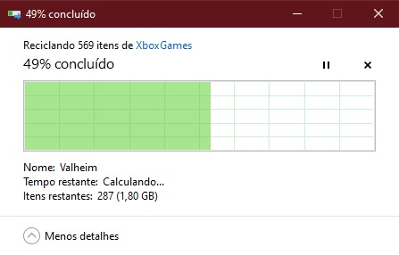
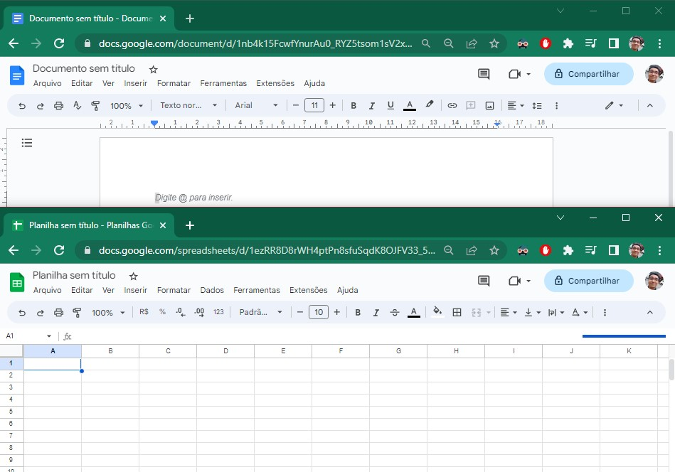
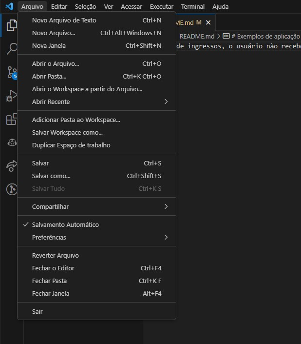
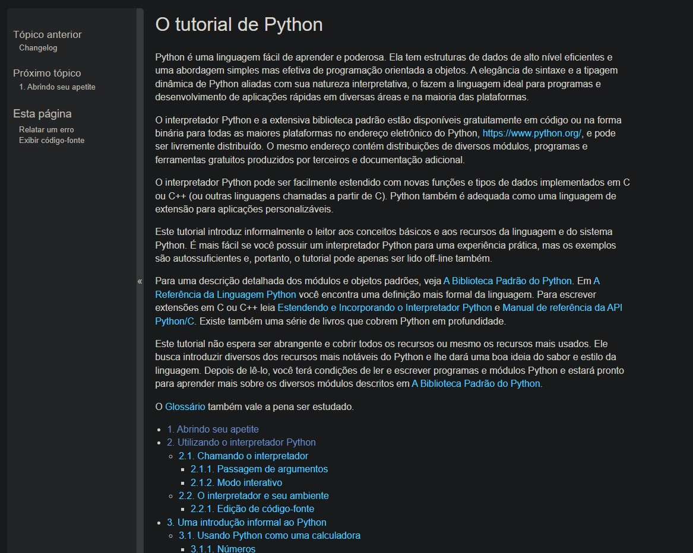
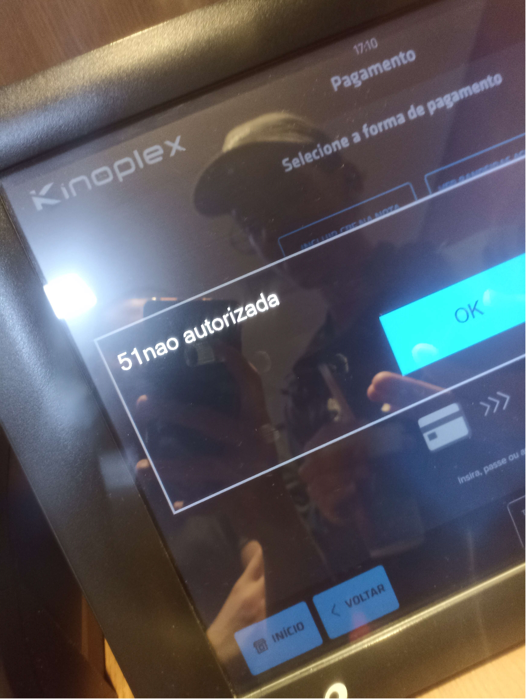

# IHC - Interação Humano Computador - As 10 Heurísticas de Nielsen
### Nome: Gabriel da Cunha de Macedo
### Semestre: 3º Desenvolvimento de Software Multiplataforma

### As 10 heurísticas de usabilidade de Nielsen são diretrizes de design estabelecidas por Jakob Nielsen, um renomado especialista em usabilidade. Essas heurísticas são amplamente reconhecidas e utilizadas na área de experiência do usuário (UX) para avaliar e aprimorar a usabilidade de produtos e interfaces. Aqui estão as 10 heurísticas de Nielsen:

 

1. **Visibilidade do status do sistema:** O sistema deve manter os usuários informados sobre o que está acontecendo, fornecendo feedback adequado em tempo hábil. Isso inclui indicadores claros de progresso, tempo de carregamento e status de conclusão de tarefas.

2. **Correspondência entre o sistema e o mundo real:** O sistema deve usar linguagem e conceitos familiares ao usuário, seguindo convenções do mundo real. As informações apresentadas devem ser organizadas de maneira lógica e intuitiva, refletindo o conhecimento prévio do usuário.

3. **Controle e liberdade do usuário:** Os usuários devem ter a liberdade de desfazer ações indesejadas e explorar diferentes opções sem penalidades graves. É importante fornecer botões de "voltar" e "cancelar", além de opções claras para sair de situações indesejadas.

4. **Consistência e padrões:** Elementos de interface, como botões, ícones e menus, devem ser consistentes em todo o sistema. Os padrões de design devem seguir convenções amplamente aceitas para que os usuários possam entender e prever o comportamento do sistema.

5. **Prevenção de erros:** O sistema deve ser projetado para prevenir erros sempre que possível. Isso pode ser alcançado por meio de avisos claros, confirmações de ações perigosas e restrições em recursos que possam levar a erros.

6. **Reconhecimento ao invés de memorização:** É preferível que os usuários reconheçam elementos e opções, em vez de terem que lembrar informações específicas. Os comandos e recursos devem ser visíveis e facilmente acessíveis, reduzindo a carga cognitiva.

7. **Flexibilidade e eficiência de uso:** O sistema deve atender às necessidades de diferentes usuários, permitindo tanto para iniciantes quanto para usuários experientes. É importante oferecer atalhos de teclado, opções personalizáveis ​​e métodos rápidos de execução de tarefas.

8. **Estética e design minimalista:** O design da interface deve ser limpo, esteticamente agradável e livre de informações desnecessárias. Elementos visuais devem ser utilizados para direcionar a atenção do usuário para as informações e ações mais importantes.

9. **Ajuda e documentação:** Quando necessário, deve haver um suporte claro e acessível para ajudar os usuários a compreenderem o sistema. Isso pode incluir documentação de ajuda, tutoriais, dicas de contexto e mensagens de erro explicativas.

10. **Reconhecimento de erros:** Quando ocorrerem erros, o sistema deve fornecer mensagens de erro claras e significativas, indicando o problema de maneira não técnica e sugerindo soluções construtivas para corrigir o erro.

# Exemplos de aplicação das heurísticas de Nielsen
| ID Eurística | Imagem | Descrição |
|--|--|--|
| 1 |  | O sistema operacional Windows é um exemplo de manter os usuários informados sobre o que está acontecendo, no exemplo da imagem, ao tentar excluir algum arquivo grande, o sistema fica constantemente informando ao usuário o progresso da exclusão do arquivo e o tempo restante para a conclusão da tarefa |
| 2 |  | O navegador Edge é um exemplo de sistema que utiliza linguagem e conceitos familiares ao usuário, no exemplo da imagem, ao usuário entrar em um site inexistente, oa invés de aparecer alguma mensagem de erro técnica como "404 Not Found", o sistema utiliza uma linguagem mais simples e intuitiva para o usuário, "Hum... Não consigo chegar a esta página" |
| 4 |  | O sistema do Google Docs é um bom exemplo de consistência e padrões, o sistema utiliza elementos de interface como botões, ícones e menus, que são consistentes em todo o sistema, o sistema também segue convenções amplamente aceitas para que os usuários possam entender e prever o comportamento do sistema |
| 5 |  | O sistema operacional Windows é um exemplo de prevenção de erros, no exemplo da imagem, ao tentar excluir algum arquivo importante para o funcionamento do sistema, o sistema exibe uma mensagem de aviso para o usuário, para que ele não exclua o arquivo por engano |
| 6 |  | O sistema do Twitter é um exemplo de reconhecimento ao invés de memorização, o sistema utiliza elementos visuais para direcionar a atenção do usuário para as informações e ações mais importantes, no exemplo da imagem, o sistema utiliza um ícone de coração para o usuário curtir um tweet, ao invés de utilizar um texto como "Curtir", o que é um padrão amplamente aceito entre redes sociais |
| 7 |  | O sistema do Visual Code é um exemplo de flexibilidade e eficiência de uso, o sistema atende às necessidades de diferentes usuários, permitindo tanto para iniciantes quanto para usuários experientes, o sistema possui vários atalhos de teclado, opções personalizáveis ​​e métodos rápidos de execução de tarefas |
| 8 |  | A página inicial do aplicativo da SHEIN é um exemplo de uma interface desagradável, o usuário após abrir o aplicativo pode se sentir "perdido" pela quantidade de textos e imagens |
| 8 |  | A página inicial do site da Terabyte é um exemplo de uma interface agradável, o sistema possui uma interface limpa e organizada, com poucos textos e imagens, mas bem claro e objetivo, fácil de entender |
| 9 |  | A documentação do Python é um exemplo de uma interface que ajuda o usuário a compreender o sistema, a documentação é bem organizada e possui uma barra de pesquisa para facilitar a busca de informações |
| 10 |  | O sistema da Kinoplex para realizar a compra de ingressos autônomo é um exemplo de uma interface que não possui mensagens de erro claras e significativas, no exemplo da imagem, após dar um erro na compra de ingressos, o usuário não recebe uma mensagem de erro específica, apenas "51nao autorizada" |